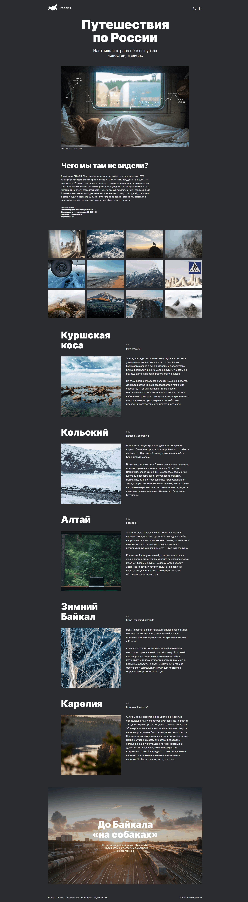

# Путешествие по России

Проект одностроничного адаптивного сайта для закрепления навыков, полученных при прохождении курса **Веб-разработчик**.

### Технологии
* HTML5
* CSS3
* Nested BEM
* Flexbox
* Grid Layout
* Figma

[Ссылка на сайт **Путешествие по России**](https://dmitry-user.github.io/russian-travel/)
